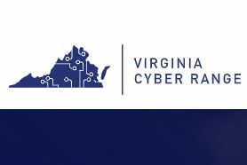

# virginia-cyber-range - Group 13's submission at the AWS Hackathon for Good 2019 in Washington, DC.

##Problem Addressed by This App:
* VCR wants teacher to teacher online forum that students can not access 
* Difficult to maintain server(full) platform such as phpBB
* Difficult to maintain a curated knowledge base

##Our Solution:
* A Q&A Platform that automatically generates knowledge base
* Teachers can post questions, can answer questions, and can upvote/downvote answers to create a "best of" knowledge base
* A Q&A pair (Q:A) ranked highly enough will be automatically added to knowledgebase 

##The Value-Add:
* No Maintenance Q&A Platform
* Automatically generated knowledge base saves teachers time and allows for discovery of important information

##Technologies Employed:
* Amazon Cognito - User Auth
* Amazon Lambda - Logic
* DynamoDB - Data Storage 
* Amazon Aurora  (planned) - File Storage
* S3 (planned) - Static Deployment

##Social Impact and Value:
* Connects teachers and builds community
* Enables teachers to provide students a quality cybersecurity education
* Makes jobs of curriculum developers easier

##Originality:
* No existing Q&A forum automatically creates knowledge base

##Challenges:
* Entire group was unfamiliar with serverless technology
* Unfamiliar with cloud in general
* Unfamiliar with noSQL
* Coming up with novel and useful concept 

#Successes:
* Proof of Concept of useful platform 
* Learned new technologies
* Created a solution to problem posed
* Created a novel addition to Q&A platform (will make lives of stakeholders easier) 
